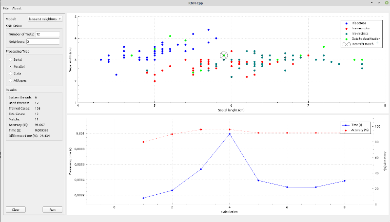

# KNN-CPp

KNN-CPp é uma interface gráfica feita em C++/Qt para visualização e comparação de desempenho de redes KNN (*k-nearest neighbors algorithm*) utilizando a base de dados de Iris. A ideia é implementar as rotinas em modo serial, paralelo e utilizando CUDA. Quem sabe mais pra frente implementar outros modelos. Só uma brincadeira :)

  

- Linux Mint 20
- Qt 5.15.0
- Compilador Clang x68 64bits
- CUDA 11.0